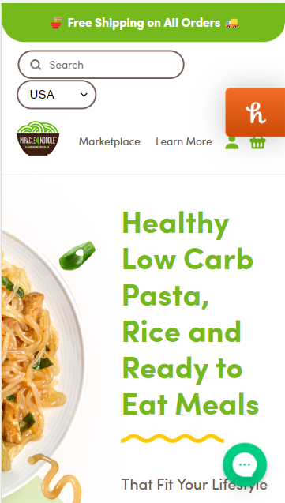

# Procesverslag
Markdown is een simpele manier om HTML te schrijven.  
Markdown cheat cheet: [Hulp bij het schrijven van Markdown](https://github.com/adam-p/markdown-here/wiki/Markdown-Cheatsheet).

Nb. De standaardstructuur en de spartaanse opmaak van de README.md zijn helemaal prima. Het gaat om de inhoud van je procesverslag. Besteedt de tijd voor pracht en praal aan je website.

Nb. Door *open* toe te voegen aan een *details* element kun je deze standaard open zetten. Fijn om dat steeds voor de relevante stuk(ken) te doen.

## Ik Eva Burgering

  
uitwerken voor kick-off werkgroep

  ### Auteur:
  Eva Burgering

  #### Je startniveau:
  Ik zit momenteel gegrond op de blauwe pieste maar wil mezelf en oefenen om op de rode pieste te kunnen komen.

  #### Je focus:
  Ik wil voor dit project mijn focus leggen op het expirimenteren en meer elementen toevoegen van de surface plane
 

## Je website

  
Na de uitleg van het project werd het een beetje warm onder de voeten aangezien 4 weken erg kort klinkt voor dit project. Ik weet dat het haalbaar is aangezien ze niets voor niets deze tijd er aan gehangen hebben. Ik snapte denk ik) al vrij wel wat er van me verwacht werd en heb gelijk besloten om een planning te maken aangezien ik voor coderen veel tijd nodig heb.

  ### Je opdracht:
  https://miraclenoodle.com/ 

  #### Screenshot(s) van de eerste pagina (small screen): 
  hier de naam van de pagina  
  

  #### Screenshot(s) van de tweede pagina (small screen):
  hier de naam van de pagina  
  
 

## Toegankelijkheidstest 1/2 (week 1)

  
uitwerken na test in 1e werkgroep

  Tijdens de les gingen we onze gekozen website gebruiken met een aantal verschillende dingen. 

  ### Bevindingen
  Uit de test kwam dat mijn gekozen site niet veel rekening houd met andere methodes van navigeten dan de standaard huis.

  #### Screenreader
  Er is in deze website geen rekening gehouden met het gebruik van een screenreader.
  
  Bij deze website zou het handig zijn om eer verduidelijking te maken met een kleur vlak of rand wanneer er elementen geselecteerd worden door de gebruiker.

  #### Muis en Toetsenbord 
  Deze website heeft nog geen toepassingen voor het gebruiken van een toetsenboard maar met de muis kan je prima navigeren door de website. In de website zijn geinig of vrijwel geen hovers of andere verduidelijkings elementen toe gevoegd.
  
  Ik denk dat deze website zou kunnen proviteren van een hover state wanneer er over items gegaan word in een vorm van een andere kleur achtergrond. Ook denk ik dat er een micro animatie aan toe gevoegd kan worden om niet alleen de website speelser te maken maar om extra duidelijkheid te brengen aan de gebruiker over waar de curser over heen gaat. 

  #### Motoriek (shocks, elastiekjes)
 de website is ondanks beperking in motoriek of spasme is de website nogsteeds goed te gebruiken aangezien het alleen bestaan uit 1 scrolbeweging die naar beneden gaat. omdat de geen zijwaardse bewegingen vergd is het navigeren best makkelijk te doen. De knoppen van de website zijn groot genoeg om er in 1 keer op te kunnen drukken en staan vaak midden in het scherm waardoor ze moeilijk te missen zijn.

  #### Visueel (brillen, contrast, kleurenblind, dark/light). 
  De belangrijkste informatie van dde website zijn goed zichbaar en hebben over het algemeen een goed contrast. Bij de opmaak elementen zoals bij de "find your shape" valt echter weg bij sommige visuele beperkingen en zouden dus wat meer naar buiten gebracht kunnen worden.
  
  
 

## Breakdownschets (week 1)

  
Tijdens deze werkgroep hebben we de gekozen website getest op toegankelijkheid voor mensen met een beperking en wat de verbeterpunten zijn. Tijdens deze les ben ik er achter gekomen dat de ontwikkelaars van deze website niet veel rekeing hebben gehouden met verduidelijking van geselecteerde elementen op een laptop of compuer / screenreader. Ook heb ik geleerd dat de website met de opmaak wat beter rekeing kan houden met kleurcontrast.

  ### de hele pagina: 
  

  ### dynamisch deel (bijv menu): 
  

  ### wellicht nog een dynamisch deel (bijv filter): 
  

## Voortgang 1 (week 2)

  
Deze week heb ik een opzet gemaakt met het maken van mijn website in HTML en CSS

  ### Stand van zaken
  Het schijven van de html ging al vrij snel goed en ik durf te zeggen dat ik dit redelijk onder de knie heb.

  Het werken met selectoren vind ik super moeilijk aangezien het nergen op internet te vinden is hoe je bijvoorbeeld 1 van de 5 <sections> wilt selecteren. Dit zou ik dus echt alleen in de les kunnen vragen waardoor ik me soms beperkt voel.

  ### Agenda voor meeting
  | ik     | Sam       | Pepijn s   |     |
  
  ik bespreek: Mijn HTML
  Als er nog tijd is: Tims voor CSS

  ### Verslag van meeting
  Tijdens het feedback gesprek heb ik met de student assistent mijn HMTL door genomen. Al snel bleek dat ik wat foutjes had in de volgorde waarin in mijn code had opgesteld. verder had ik nog een aantal vragen over hoe ik sommige dingen beter semmantisch kon formuleren.

  Ik had al mijn css weg moeten doen aangezien ik in het begin vrijwel alles met classas had aangeven. Ik vond het krijgen van feedback op mijn code erg fijn maar lastig dat ik dus geen css had om te haten zien.

## Voortgang 2 (week 3)

  
Deze week ben ik verder gegaan het het schrijven van mijn css. Ik loop een beetje achter in de tijd. Voor mijn gevoel komt dit omdat ik nog niet de handige kneepjes weet en ik het af en toe nog lastig vind om de logica te zien.

  ### Stand van zaken
   ik loop een beetje achter omdat ik merk dat ik elke keer vast loop op het gebruiken van grid/flexbox. Deze week heb ik mijn best gedaan om dit zo veel mogelijk te oefenen en filmpjes er over te kijken om het verder te kunnen begrijpen. In de les heb ik hier ook vragen over gesteld en word het elke keer logisch uit gelegd en snap ik het tot dat ik thuis ben...

   Ik heb deze week wel heel veel progressie geboekt en begin het met de dag meer in de vingers te krijgen. Daar ben ik wel trots op.

  
  
  
  

  ### Agenda voor meeting
  samen met je groepje opstellen

  | Ik           | Sam     |  pepijn   
  | feedback     | html    | css           
  | css         |         |      
  |              |         |                 

  ### Verslag van meeting
  hier na afloop snel de uitkomsten van de meeting vastleggen

  - punt 1
  - punt 2
  - nog een punt
- ...

## Toegankelijkheidstest 2/2 (week 4)

  
uitwerken na test in 8e werkgroep

  ### Bevindingen
  Lijst met je bevindingen die in de test naar voren kwamen (geef ook aan wat er verbeterd is):

  #### Screenreader
  Hier korte omschrijving (met indien nodig afbeeldingen)

  Hier een omschrijving van hoe het opgelost kan worden (met indien nodig afbeeldingen)

  #### Muis en Toetsenbord 
  Hier korte omschrijving (met indien nodig afbeeldingen)

  Hier een omschrijving van hoe het opgelost kan worden (met indien nodig afbeeldingen)

  #### Motoriek (shocks, elastiekjes)
  Hier korte omschrijving (met indien nodig afbeeldingen)

  Hier een omschrijving van hoe het opgelost kan worden (met indien nodig afbeeldingen)

  #### Visueel (brillen, contrast, kleurenblind, dark/light). 
  Hier korte omschrijving (met indien nodig afbeeldingen)

  Hier een omschrijving van hoe het opgelost kan worden (met indien nodig afbeeldingen)

## Voortgang 3 (week 4)

  
uitwerken voor 3e voortgang

  ### Stand van zaken
  hier dit ging goed & dit was lastig (neem ook screenshots op van delen van je website en code)

  ### Agenda voor meeting
  samen met je groepje opstellen

  | student 1      | student 2          | student 3    | student 4        |
  | ---            | ---                | ---          | ---              |
  | dit bespreken  | en dit             | en ik dit    | en dan ik dat    |
  | en dat ook nog | dit als er tijd is | nog een punt | dit wil ik zeker |
  | ...            | ...                | ...          | ...              |

  ### Verslag van meeting
  hier na afloop snel de uitkomsten van de meeting vastleggen

  - punt 1
  - punt 2
  - nog een punt
  - ...

## Eindgesprek (week 5)

  
uitwerken voor eindgesprek

  ### Je uitkomst - karakteristiek screenshots:
  

  ### Dit ging goed/Heb ik geleerd: 
  Korte omschrijving met plaatjes

  

  ### Dit was lastig/Is niet gelukt:
  Korte omschrijving met plaatjes

  

## Bronnenlijst

  
continu bijhouden terwijl je werkt

  Nb. Wees specifiek ('css-tricks' als bron is bijv. niet specifiek genoeg).

  1. bron 1
  2. bron 2
  3. ...

